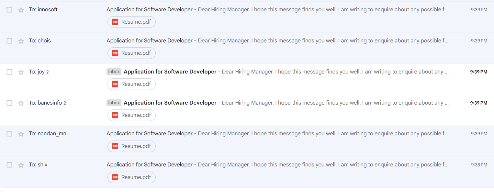

# Cold Email Script

This project is a Node.js script for sending cold emails to a list of companies extracted from a PDF document. It uses pooled SMTP connections for efficient email sending.

# Preview



## Getting Started

Follow these steps to set up and run the project on your local machine:

### Prerequisites

- Node.js (version 14 or higher)
- npm (Node Package Manager)

### Installation

1. **Clone the repository:**

    ```bash
    git clone https://github.com/yourusername/your-repository-name.git
    cd your-repository-name
    ```

2. **Install dependencies:**

    ```bash
    npm install
    ```

3. **Set up environment variables:**

    Create a `.env` file in the root directory of the project and copy the contents from `.env.example` into it. Fill out the variables with your information:

    ```plaintext
    companiesPdfPath=path/to/your/companies.pdf
    resumePath=path/to/your/resume.pdf
    userEmail=your-email@gmail.com
    userAppPassword=your-app-password
    mailTitle=Subject of Your Email
    ```

    - **Generate `userAppPassword`:** 
      To generate an app password for your Gmail account, follow these steps:
      1. Visit [Google's App Passwords page](https://myaccount.google.com/apppasswords).
      2. Sign in with your Google account if prompted.
      3. Select "Mail" as the app and "Other" as the device.
      4. Click "Generate" to create a new app password. Copy this password and paste it into the `userAppPassword` field in your `.env` file.

4. **Customize the email template:**

    Edit the `template.html` file to personalize the email body according to your preferences. Replace placeholders with actual details:

    ```html
    <body>
        <p>Dear [Recipient’s Name],</p>

        <p>I hope this message finds you well. I am reaching out to [briefly state the purpose of your email, e.g., "inquire about potential opportunities," "discuss a possible collaboration," or "share information about my recent project"].</p>

        <p>I am [Your Title/Role, e.g., "a software developer with X years of experience"] with expertise in [mention relevant skills or fields].</p>

        <p><strong>Here’s a brief overview of my skills and experience:</strong></p>
        <ul>
            <li><strong>Skills:</strong> [List your skills, e.g., "Frontend development, Backend development, Database management"]</li>
            <li><strong>Technologies:</strong> [List technologies, e.g., "React.js, Node.js, Python, PostgreSQL"]</li>
            <li><strong>Relevant Experience:</strong></li>
            <ul>
                <li>[Brief description of relevant experience, e.g., "Developed web applications using React.js and Node.js"]</li>
                <li>[Another relevant experience] </li>
            </ul>
        </ul>

        <p>Attached to this email is my [resume/portfolio/brief overview], which provides additional details about my background, skills, and experiences. I believe that my background makes me a strong candidate for [state the opportunity or role you're interested in].</p>

        <p>I am enthusiastic about the prospect of [mention what you are excited about, e.g., "joining your team," "collaborating on this project," or "exploring this opportunity"].</p>

        <p>Thank you for considering my [application/proposal/inquiry]. I look forward to discussing how my skills and experiences align with your [team’s needs/project’s goals].</p>

        <p>Best Regards,<br>
        [Your Full Name]<br>
        [Your Contact Information]</p>

        <p><strong>Portfolio:</strong> <a href="[Your Portfolio Link]">[Your Portfolio Link]</a><br>
        <strong>LinkedIn:</strong> <a href="[Your LinkedIn Profile]">[Your LinkedIn Profile]</a><br>
        <strong>GitHub:</strong> <a href="[Your GitHub Profile]">[Your GitHub Profile]</a></p>
    </body>
    ```

### Running the Script

To execute the script, run the following command:

```bash
node index.js
